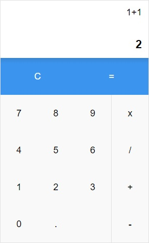

# Calculator 

A React Redux Calculator




## Prerequisite

Git & npm


## Getting started

1. Clone the repository
```
git clone https://github.com/PierreEv/calculator-app.git
```

2. Package installation
```
npm install
```

3. Start the React App
```
npm start
```
The application will start automatically on http://localhost:3000


## Additional Features
  - As **developer**, on SPACE down a random compute is achieved.
  - As **admin**, LIST button toggle the list of all past computes. You can search a result thanks to the text input.


## User roles
You can add **user-role** as url parameter to switch between role, as below:

Role | Url
------------ | -------------
default user |[no params](http://localhost:3000/)
developer | ["?user-role=developer"](http://localhost:3000/?user-role=developer)
admin | ["?user-role=admin"](http://localhost:3000/?user-role=admin)


## To do
- [ ] Add highlight for matching text (Admin / Search result)
- [ ] Improve random computes creation (Developer)
- [ ] Do not use `eval()` to execute calculations